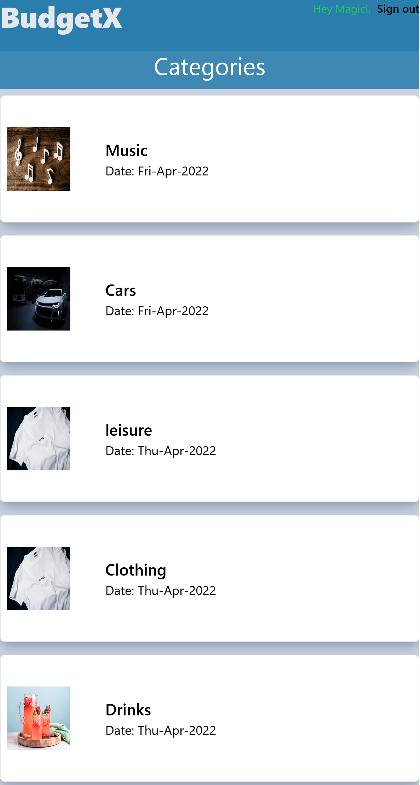

# Recipe-App

> This is a budget app with backend built using Ruby on Rails framework. It involves creating  item categories and transactions from those categories. The categories have a more detailed page for the specific transaction.




## Live Version

[ Video Documentation](https://www.loom.com/share/a141cf72e1294e80bb68c5d3910c8fdb)
## Built With

- Ruby
- Ruby on Rails
- Tailwind
## Getting Started

- Getting a local copy is simple. Follow the steps below
### Install
- Ruby
- Ruby on Rails
- PostgresSQL
- Rspec
- Tailwindcss


### Local Copy

- Clone the project

```
git@github.com:DelhinRharl/Budgetx.git

cd Budgetx

```

### Setup

Install gems:

```
bundle install
```

Setup database:

```
rails db:create
rails db:migrate
```

### Usage

Start server:

```
rails server
```

Visit http://localhost:3000/ in your browser.

### Run tests

```
rspec
```
 
  ## Authors
👤 **Affaxed Kiprotich**

- GitHub: [@DelhinRharl](https://github.com/DelhinRharl)
- Twitter: [@affaxed-kip](https://twitter.com/affaxed-kip)
- LinkedIn: [Affaxed Kiprotich](https://www.linkedin.com/in/affaxed-kiprotich/)

## 🤝 Contributing

Contributions, issues, and feature requests are welcome!

## Show your support

Give a ⭐️ if you like this project!
## 📝 License

This project is [MIT](./LICENSE.md) licensed.
